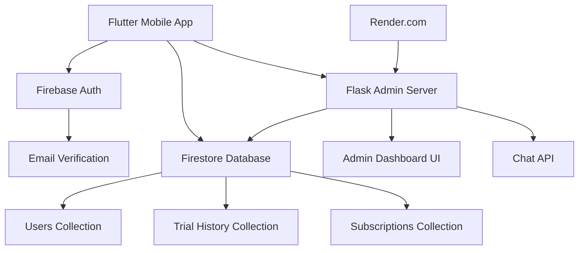

# User Management System Design

## Overview

The User Management System is built using Flutter for the mobile client and Firebase for backend services, with a Flask admin dashboard for monitoring. The system follows a microservices architecture with clear separation between authentication, user data, trial management, and subscription handling.

## Architecture



## Components and Interfaces

### 1. Authentication Service (`lib/services/auth_service.dart`)

**Purpose:** Handles user registration, login, and email verification

**Key Methods:**
- `signUpWithEmailAndPassword()` - Creates new user account
- `signInWithEmailAndPassword()` - Authenticates existing users
- `sendEmailVerification()` - Triggers email verification
- `checkEmailVerified()` - Validates email verification status

**Firebase Integration:**
- Uses Firebase Authentication for secure user management
- Integrates with Firestore for user profile data
- Handles authentication state changes

### 2. Firestore Service (`lib/services/firestore_service.dart`)

**Purpose:** Manages all database operations and user data persistence

**Key Methods:**
- `createUserProfile()` - Creates user document in Firestore
- `updateUserProfile()` - Updates user information
- `getUserProfile()` - Retrieves user data
- `updateEmailVerificationStatus()` - Marks email as verified

**Collections:**
- `users` - User profiles and verification status
- `trial_history` - Trial periods and dates
- `subscriptions` - Subscription data and billing

### 3. Subscription Service (`lib/services/subscription_service.dart`)

**Purpose:** Handles trial creation, subscription management, and premium access

**Key Methods:**
- `createTrialHistory()` - Initiates 7-day trial period during first verified login
- `checkTrialStatus()` - Validates current trial status
- `createSubscription()` - Processes subscription signup
- `cancelSubscription()` - Handles subscription cancellation
- `checkPremiumAccess()` - Validates premium feature access

**Business Logic:**
- Trial periods are 7 days from first login after email verification
- Trial creation is triggered during the login process for verified users
- Subscriptions are $3/month recurring
- Cancelled subscriptions remain active until billing period end

### 3.1 Payment Service (`lib/services/payment_service.dart`)

**Purpose:** Handles secure payment processing and billing operations

**Key Methods:**
- `initializePayment()` - Sets up payment session with Stripe/PayPal
- `processPayment()` - Handles payment processing and validation
- `setupRecurringBilling()` - Configures monthly subscription billing
- `updatePaymentMethod()` - Updates stored payment information
- `processRefund()` - Handles refund requests and processing
- `handleFailedPayment()` - Manages payment failures and retries

**Payment Integration:**
- Stripe SDK for credit card processing
- PayPal SDK for PayPal payments
- Google Pay and Apple Pay integration
- PCI-compliant payment data handling
- Webhook handling for payment status updates

### 4. Mobile App UI Components

#### 4.1 Authentication Screens (`lib/screens/auth/`)

**Login Screen (`login_screen.dart`):**
- Email and password input fields with validation
- Login button with loading states
- Navigation to signup and password reset
- Email verification prompt for unverified users
- **Mobile Optimization**: Compact form layout with 12px padding, 14px font size for inputs, minimal vertical spacing

**Signup Screen (`signup_screen.dart`):**
- Email, username, and password input with real-time validation
- Password strength indicator
- Terms of service acceptance
- Clear error messaging and success feedback
- **Mobile Optimization**: Condensed form fields, inline validation messages, compact button spacing

**Email Verification Screen (`email_verification_screen.dart`):**
- Clear instructions for email verification
- Resend verification email button
- Manual refresh option to check verification status
- Navigation back to login after verification
- **Mobile Optimization**: Minimal text content, compact button layout, essential information only

#### 4.2 Status Display Components (`lib/widgets/`)

**Email Verification Banner (`email_verification_banner.dart`):**
- Prominent banner for unverified users
- Resend email functionality
- Dismissible with verification check
- **Mobile Optimization**: Compact banner height (48px), small font size (12px), minimal padding (8px)

**Subscription Status Widget (`subscription_status_widget.dart`):**
- Current status display with color-coded badges
- Trial countdown with days remaining
- Premium subscriber indicator (red diamond)
- Subscription management navigation
- **Mobile Optimization**: Condensed status cards, small badge icons (16px), compact text layout

**App Bar Status Indicator:**
- Trial countdown display in app bar
- Premium status indicator (red diamond icon)
- Clean, space-efficient design
- **Mobile Optimization**: Small status indicators (20px), minimal text, efficient icon usage

#### 4.3 Profile and Settings Screens

**Profile Screen (`profile_screen.dart`):**
- User information display
- Subscription status section
- Account management options
- Logout functionality
- **Mobile Optimization**: Collapsible sections, compact list items, small avatar (40px), condensed spacing

**Subscription Management:**
- Current plan details
- Billing information
- Upgrade/downgrade options
- Cancellation flow with confirmation
- **Mobile Optimization**: Tabbed interface for space efficiency, compact pricing display, minimal form padding

#### 4.4 Mobile Space Optimization Design Principles

**Typography Scale:**
- Headers: 18-20px (reduced from 24-28px)
- Body text: 14px (reduced from 16px)
- Small text: 12px (reduced from 14px)
- Captions: 10px (reduced from 12px)

**Spacing System:**
- Large spacing: 16px (reduced from 24px)
- Medium spacing: 12px (reduced from 16px)
- Small spacing: 8px (reduced from 12px)
- Micro spacing: 4px (reduced from 8px)

**Component Sizing:**
- Button height: 44px (minimum touch target)
- Input field height: 40px (reduced from 48px)
- List item height: 48px (reduced from 56px)
- Card padding: 12px (reduced from 16px)

**Layout Optimizations:**
- Bottom navigation instead of drawer for main navigation
- Horizontal scrolling for data tables on small screens
- Expandable/collapsible sections for detailed information
- Floating action buttons for primary actions
- Compact dialogs with minimal padding
- Inline form validation to save vertical space

**Content Prioritization:**
- Essential information displayed prominently
- Secondary details hidden in expandable sections
- Progressive disclosure for complex features
- Context-aware content based on user status
- Minimal text with clear, concise messaging

### 5. Flask Admin Server with Business Intelligence (`app.py`)

**Purpose:** Provides comprehensive admin dashboard with business analytics and chat API functionality

**Key Endpoints:**
- `GET /` - Admin dashboard interface with KPI widgets
- `GET /api/users` - User journey data with behavioral analytics
- `GET /api/stats` - Dashboard statistics and KPIs
- `GET /api/analytics/revenue` - Revenue metrics (MRR, ARPU, trends)
- `GET /api/analytics/conversion` - Conversion funnel analysis
- `GET /api/analytics/retention` - User retention and churn analysis
- `GET /api/analytics/geographic` - Geographic distribution for OFW markets
- `GET /api/analytics/performance` - App performance and error metrics
- `GET /api/export/users` - Data export functionality
- `POST /chat` - AI chat functionality
- `POST /summarize_chat` - Conversation summarization

**Business Intelligence Components:**

#### 5.1 KPI Dashboard (`/api/dashboard/kpis`)
- **User Metrics**: Total users, active users, new registrations (daily/weekly/monthly)
- **Revenue Metrics**: MRR, ARPU, total revenue, revenue growth rate
- **Conversion Metrics**: Registration→Trial, Trial→Paid, overall conversion funnel
- **Retention Metrics**: User retention rates (1-day, 7-day, 30-day), churn rate
- **Subscription Metrics**: Active subscriptions, cancelled subscriptions, subscription growth

#### 5.2 Analytics Engine (`lib/analytics/`)
- **Cohort Analysis**: User retention by registration cohorts
- **Funnel Analysis**: Step-by-step conversion tracking
- **Revenue Analysis**: MRR trends, revenue forecasting, ARPU by user segments
- **Geographic Analysis**: OFW user distribution by destination countries
- **Behavioral Analysis**: Feature usage, session duration, user engagement

#### 5.3 Alerting System (`lib/alerts/`)
- **Critical Alerts**: High churn rate, payment failure spikes, system errors
- **Business Alerts**: Revenue targets, conversion rate drops, user acquisition goals
- **Performance Alerts**: App crashes, API response times, database performance

**Data Processing:**
- Aggregates user data from multiple Firestore collections
- Calculates complex business metrics and KPIs
- Provides real-time analytics with historical trend analysis
- Generates actionable insights for business decision-making

### 6. Financial Management System (`lib/financial/`)

**Purpose:** Comprehensive financial tracking, accounting, and reporting system

#### 6.1 Revenue Tracking (`financial_service.dart`)
- **Subscription Revenue**: Automatic tracking of monthly recurring revenue
- **Payment Processing**: Integration with Stripe/PayPal for real-time revenue updates
- **Refund Management**: Automatic adjustment of revenue when refunds are processed
- **Proration Handling**: Accurate calculation of subscription changes and upgrades

#### 6.2 Expense Management (`expense_service.dart`)
- **Expense Categories**: Server costs, payment processing fees, marketing, development
- **Automatic Expenses**: Payment processing fees, server costs from cloud providers
- **Manual Expense Entry**: Marketing costs, contractor payments, office expenses
- **Receipt Management**: Digital receipt storage and categorization

#### 6.3 Financial Reporting (`reporting_service.dart`)
- **Profit & Loss Statements**: Monthly, quarterly, and annual P&L reports
- **Cash Flow Reports**: Track money in/out with timing analysis
- **Tax Reports**: Tax-compliant categorization for business deductions
- **Financial Metrics**: Gross margin, net profit, EBITDA calculations

#### 6.4 Accounting Integration (`accounting_integration.dart`)
- **QuickBooks Integration**: Automatic sync of transactions and categories
- **Xero Integration**: Real-time financial data synchronization
- **CSV Export**: Standard accounting format exports
- **Audit Trail**: Complete transaction history with timestamps

**Firestore Collections:**
```dart
// Financial data structure
transactions: {
  transactionId: {
    type: 'revenue' | 'expense' | 'refund',
    amount: number,
    currency: string,
    category: string,
    description: string,
    date: timestamp,
    userId?: string,
    paymentMethod: string,
    fees: number,
    netAmount: number
  }
}

expenses: {
  expenseId: {
    category: 'server' | 'marketing' | 'development' | 'payment_processing',
    amount: number,
    currency: string,
    description: string,
    date: timestamp,
    receipt?: string,
    vendor: string,
    isRecurring: boolean
  }
}

budgets: {
  budgetId: {
    category: string,
    monthlyLimit: number,
    currentSpend: number,
    alertThreshold: number,
    year: number,
    month: number
  }
}
```

### 7. Fraud Protection and Security System (`lib/security/`)

**Purpose:** Comprehensive fraud detection, prevention, and user protection system

#### 7.1 Fraud Detection Engine (`fraud_detection_service.dart`)
- **Behavioral Analysis**: Monitor user patterns for suspicious activity
- **Device Fingerprinting**: Track device characteristics for security
- **Geolocation Monitoring**: Detect unusual login locations
- **Transaction Monitoring**: Flag suspicious payment patterns
- **Bot Protection**: CAPTCHA integration and automated behavior detection
- **Rate Limiting**: Prevent rapid-fire requests and API abuse
- **Honeypot Fields**: Hidden form fields to catch automated submissions
- **Behavioral Biometrics**: Analyze typing patterns and interaction timing

#### 7.2 Multi-Factor Authentication (`mfa_service.dart`)
- **SMS Verification**: Two-factor authentication via SMS
- **Email Verification**: Secondary email confirmation
- **Biometric Authentication**: Fingerprint/Face ID integration
- **Backup Codes**: Recovery codes for account access

#### 7.3 Data Protection and Encryption (`encryption_service.dart`)
- **Data Tokenization**: Replace sensitive data with secure tokens
- **Field-Level Encryption**: Encrypt sensitive fields in database
- **Secure Document Handling**: Encrypted document upload and storage
- **PII Redaction**: Automatic removal of sensitive information

#### 7.4 Bot Protection System (`bot_protection_service.dart`)
- **CAPTCHA Integration**: Google reCAPTCHA v3 for registration and login
- **Rate Limiting**: IP-based and user-based request throttling
- **Behavioral Analysis**: Detect non-human interaction patterns
- **Honeypot Traps**: Hidden fields and links to catch bots
- **Device Fingerprinting**: Identify and block suspicious devices
- **IP Reputation**: Block known bot networks and proxy services

#### 7.5 Security Monitoring (`security_monitoring_service.dart`)
- **Access Logging**: Comprehensive audit trail of all data access
- **Anomaly Detection**: AI-powered detection of unusual patterns
- **Incident Response**: Automated response to security threats
- **User Education**: In-app security tips and fraud awareness

**Security Features:**
```dart
// Security and fraud protection data structure
security_events: {
  eventId: {
    userId: string,
    eventType: 'login_attempt' | 'suspicious_activity' | 'fraud_detected' | 'mfa_challenge',
    timestamp: timestamp,
    ipAddress: string,
    deviceFingerprint: string,
    location: {
      country: string,
      city: string,
      coordinates?: object
    },
    riskScore: number,
    action: 'allowed' | 'blocked' | 'challenged',
    details: object
  }
}

user_security_settings: {
  userId: {
    mfaEnabled: boolean,
    trustedDevices: array,
    securityQuestions: array,
    lastPasswordChange: timestamp,
    accountLockout: {
      isLocked: boolean,
      lockReason: string,
      lockedAt: timestamp,
      unlockAt: timestamp
    }
  }
}

fraud_alerts: {
  alertId: {
    userId: string,
    alertType: 'suspicious_login' | 'unusual_payment' | 'account_compromise' | 'bot_detected',
    severity: 'low' | 'medium' | 'high' | 'critical',
    description: string,
    timestamp: timestamp,
    resolved: boolean,
    actions: array
  }
}

bot_protection: {
  sessionId: {
    ipAddress: string,
    userAgent: string,
    captchaScore: number,
    behaviorScore: number,
    isBot: boolean,
    detectionMethods: array,
    timestamp: timestamp,
    actions: ['blocked' | 'challenged' | 'monitored'],
    honeypotTriggered: boolean,
    rateLimitExceeded: boolean
  }
}

rate_limiting: {
  limitId: {
    ipAddress: string,
    userId?: string,
    endpoint: string,
    requestCount: number,
    windowStart: timestamp,
    windowEnd: timestamp,
    isBlocked: boolean,
    blockReason: string
  }
}
```

### 8. AI-Powered Suggestion System (`lib/suggestions/`)

**Purpose:** Intelligent content recommendation and user guidance system

#### 8.1 Suggestion Engine (`suggestion_service.dart`)
- **Random Selection**: Fetch random suggestions from Firestore collection
- **Contextual Filtering**: Filter suggestions based on user status and preferences
- **Engagement Tracking**: Monitor user interactions with suggestions
- **Content Optimization**: Adapt suggestions based on user behavior

#### 8.2 Content Management (`suggestion_content_service.dart`)
- **OFW-Specific Content**: Job tips, remittance advice, legal guidance
- **Multi-Language Support**: Suggestions in English, Filipino, Arabic, etc.
- **Category Management**: Organize suggestions by type (onboarding, tips, features)
- **Admin Content Updates**: Easy suggestion management via admin dashboard

#### 8.3 User Experience Components (`lib/widgets/suggestions/`)
- **Suggestion Cards**: Attractive, actionable suggestion display
- **Dismissal System**: Allow users to hide irrelevant suggestions
- **Navigation Integration**: Direct links to relevant app features
- **Offline Caching**: Store suggestions for offline viewing

**Firestore Collections:**
```dart
// Suggestion system data structure
suggestions: {
  suggestionId: {
    title: string,
    description: string,
    category: 'onboarding' | 'job_tips' | 'remittance' | 'legal' | 'features',
    targetAudience: 'new_users' | 'trial_users' | 'premium_users' | 'all',
    language: 'en' | 'fil' | 'ar' | 'zh',
    actionType: 'navigate' | 'external_link' | 'modal',
    actionData: {
      route?: string,
      url?: string,
      modalContent?: string
    },
    priority: number,
    isActive: boolean,
    createdAt: timestamp,
    updatedAt: timestamp,
    engagementStats: {
      views: number,
      clicks: number,
      dismissals: number
    }
  }
}

user_suggestion_preferences: {
  userId: {
    dismissedSuggestions: array,
    preferredCategories: array,
    language: string,
    lastShownSuggestions: array,
    engagementHistory: {
      suggestionId: {
        viewedAt: timestamp,
        clickedAt?: timestamp,
        dismissedAt?: timestamp
      }
    }
  }
}

suggestion_analytics: {
  analyticsId: {
    suggestionId: string,
    userId: string,
    action: 'viewed' | 'clicked' | 'dismissed',
    timestamp: timestamp,
    userStatus: 'trial' | 'premium' | 'free',
    sessionId: string
  }
}
```

### 9. Podcast and Storytelling Platform (`lib/media/`)

**Purpose:** Comprehensive audio content platform for OFW community engagement and storytelling

#### 9.1 Audio Streaming Service (`audio_service.dart`)
- **Podcast Streaming**: High-quality audio streaming with buffering
- **Audio Controls**: Play/pause, seek, speed adjustment, volume control
- **Offline Support**: Download episodes for offline listening
- **Background Playback**: Continue playing when app is minimized

#### 9.2 Content Management (`content_service.dart`)
- **Podcast Curation**: Manage OFW-focused podcast episodes
- **Story Submission**: Handle user-generated audio and text stories
- **Content Moderation**: Review and approve user submissions
- **Category Management**: Organize content by themes and topics

#### 9.3 User-Generated Content (`story_service.dart`)
- **Audio Recording**: In-app audio recording for story sharing
- **Text Stories**: Rich text editor for written experiences
- **Content Upload**: Secure file upload with compression
- **Publishing Workflow**: Draft, review, publish process

#### 9.4 Social Features (`social_media_service.dart`)
- **Engagement System**: Likes, comments, shares for content
- **User Following**: Follow favorite storytellers and creators
- **Playlists**: Personal collections of favorite content
- **Recommendations**: AI-powered content suggestions

**Firestore Collections:**
```dart
// Podcast and storytelling data structure
podcasts: {
  podcastId: {
    title: string,
    description: string,
    audioUrl: string,
    thumbnailUrl: string,
    duration: number,
    category: 'success_stories' | 'job_tips' | 'cultural' | 'legal_advice' | 'mental_health',
    language: 'en' | 'fil' | 'ar' | 'zh',
    country: string,
    isPremium: boolean,
    createdAt: timestamp,
    createdBy: string,
    playCount: number,
    likes: number,
    isActive: boolean
  }
}

user_stories: {
  storyId: {
    userId: string,
    title: string,
    content?: string,
    audioUrl?: string,
    type: 'audio' | 'text' | 'mixed',
    category: 'success' | 'challenge' | 'cultural' | 'advice' | 'homesickness',
    country: string,
    jobType: string,
    language: string,
    status: 'draft' | 'pending_review' | 'published' | 'rejected',
    moderationNotes?: string,
    createdAt: timestamp,
    publishedAt?: timestamp,
    likes: number,
    comments: number,
    shares: number,
    isAnonymous: boolean
  }
}

user_playlists: {
  playlistId: {
    userId: string,
    name: string,
    description: string,
    items: [{
      contentId: string,
      contentType: 'podcast' | 'story',
      addedAt: timestamp
    }],
    isPublic: boolean,
    createdAt: timestamp,
    updatedAt: timestamp
  }
}

content_engagement: {
  engagementId: {
    userId: string,
    contentId: string,
    contentType: 'podcast' | 'story',
    action: 'like' | 'comment' | 'share' | 'play' | 'download',
    timestamp: timestamp,
    metadata?: object
  }
}

content_comments: {
  commentId: {
    contentId: string,
    contentType: 'podcast' | 'story',
    userId: string,
    comment: string,
    parentCommentId?: string,
    createdAt: timestamp,
    likes: number,
    isModerated: boolean
  }
}
```

### 10. Legal Compliance System (`lib/legal/`)

**Purpose:** Comprehensive legal document management and compliance tracking

#### 7.1 Terms and Conditions Management (`legal_service.dart`)
- **Document Versioning**: Track versions of Terms and Conditions with timestamps
- **User Acceptance Tracking**: Record when users accept each version
- **Update Notifications**: Notify users when legal documents are updated
- **Re-acceptance Flow**: Require users to accept updated terms

#### 7.2 Privacy Policy Management (`privacy_service.dart`)
- **Privacy Policy Versioning**: Maintain different versions with change logs
- **Data Collection Disclosure**: Clear explanation of data collection practices
- **Cookie Policy**: Manage cookie consent and tracking preferences
- **Data Deletion Requests**: Handle GDPR/CCPA data deletion requests

#### 7.3 Legal Document UI Components (`lib/widgets/legal/`)
- **Terms Acceptance Widget**: Checkbox with link to full terms
- **Privacy Policy Display**: Formatted, scrollable legal document viewer
- **Legal Update Notifications**: In-app notifications for legal changes
- **Consent Management**: Cookie and tracking consent interface

**Firestore Collections:**
```dart
// Legal compliance data structure
legal_documents: {
  documentId: {
    type: 'terms' | 'privacy' | 'cookie_policy',
    version: string,
    content: string,
    effectiveDate: timestamp,
    isActive: boolean,
    previousVersion?: string
  }
}

user_legal_acceptance: {
  userId: {
    termsAccepted: {
      version: string,
      acceptedAt: timestamp,
      ipAddress: string,
      userAgent: string
    },
    privacyAccepted: {
      version: string,
      acceptedAt: timestamp,
      ipAddress: string,
      userAgent: string
    },
    cookieConsent: {
      essential: boolean,
      analytics: boolean,
      marketing: boolean,
      consentedAt: timestamp
    }
  }
}

legal_audit_log: {
  logId: {
    userId: string,
    action: 'terms_accepted' | 'privacy_accepted' | 'data_deleted' | 'consent_updated',
    timestamp: timestamp,
    ipAddress: string,
    userAgent: string,
    documentVersion?: string,
    details: object
  }
}
```

## Data Models

### User Document (`users` collection)
```dart
class UserProfile {
  String uid;
  String email;
  String username;
  bool emailVerified;
  DateTime? emailVerifiedAt;
  DateTime createdAt;
  DateTime? lastLoginAt;
}
```

### Trial History Document (`trial_history` collection)
```dart
class TrialHistory {
  String userId;
  String email;
  DateTime trialStartDate;
  DateTime trialEndDate;
  DateTime createdAt;
}
```

### Subscription Document (`subscriptions` collection)
```dart
class Subscription {
  String email;
  bool isActive;
  DateTime subscriptionStartDate;
  DateTime subscriptionEndDate;
  bool cancelled;
  DateTime? willExpireAt;
  double monthlyPrice; // $3.00
}
```

## Error Handling

### Authentication Errors
- Invalid email format validation
- Weak password rejection
- Duplicate email registration handling
- Network connectivity issues

### Trial Management Errors
- Duplicate trial prevention
- Trial expiration edge cases
- Date calculation accuracy

### Subscription Errors
- Payment processing failures
- Subscription state inconsistencies
- Cancellation timing issues

### Admin Dashboard Errors
- Firebase connection failures
- Data aggregation timeouts
- Real-time update failures

## Testing Strategy

### Unit Tests
- Authentication service methods
- Subscription business logic
- Date calculations and trial status
- Data model validation
- Payment processing logic

### Integration Tests
- Firebase authentication flow
- Firestore data operations
- Email verification process
- Subscription lifecycle
- Payment processing integration

### Widget Tests
- Login and signup screens
- Email verification UI
- Subscription status display
- Premium feature access
- Payment forms and confirmation screens

### End-to-End Tests
- Complete user registration flow
- Trial to subscription conversion
- Subscription cancellation process
- Admin dashboard functionality
- Payment processing workflows

### Device Compatibility Testing
- **Android Testing Matrix:**
  - Android 7.0 - 14.0 (API levels 24-34)
  - Samsung Galaxy (S20, S21, S22, S23 series)
  - Google Pixel (4, 5, 6, 7, 8 series)
  - OnePlus devices (8, 9, 10, 11 series)
  - Various screen sizes (5", 6", 6.5", tablets)

- **iOS Testing Matrix:**
  - iOS 12.0 - 17.0
  - iPhone models (SE, 12, 13, 14, 15 series)
  - iPad models (Air, Pro, Mini)
  - Various screen sizes and resolutions

- **Cloud Testing Integration:**
  - Firebase Test Lab for Android
  - AWS Device Farm for cross-platform testing
  - BrowserStack App Live for real device testing
  - Automated testing across device matrix

## Security Considerations

### Data Protection
- Firebase security rules for collection access
- User data isolation by authentication
- Encrypted data transmission (HTTPS)
- Secure API key management

### Authentication Security
- Firebase Authentication encryption
- Email verification requirements
- Session management and timeouts
- Password strength enforcement

### Admin Dashboard Security
- Environment variable protection
- Firebase service account security
- API endpoint authentication
- Secure deployment practices

## Performance Optimization

### Database Optimization
- Efficient Firestore queries with indexing
- Minimal data transfer with field selection
- Caching for frequently accessed data
- Batch operations for bulk updates

### Mobile App Performance
- Lazy loading of user data
- Efficient state management
- Optimized widget rebuilds
- Background sync for offline support

### Admin Dashboard Performance
- Pagination for large user lists
- Efficient data aggregation
- Manual refresh to reduce server load
- Optimized table rendering

## Deployment Architecture

### Mobile App
- Flutter build for Android/iOS
- Firebase configuration per environment
- App store deployment pipeline

### Admin Server
- Render.com deployment
- Environment variable management
- Auto-deployment from GitHub
- Health monitoring and logging