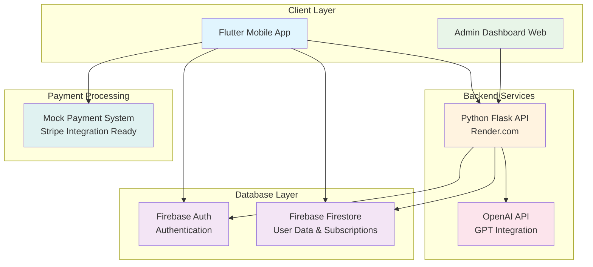
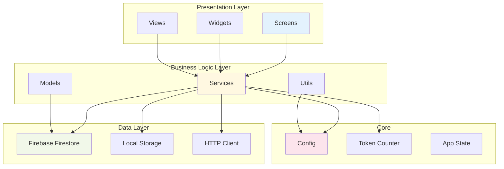
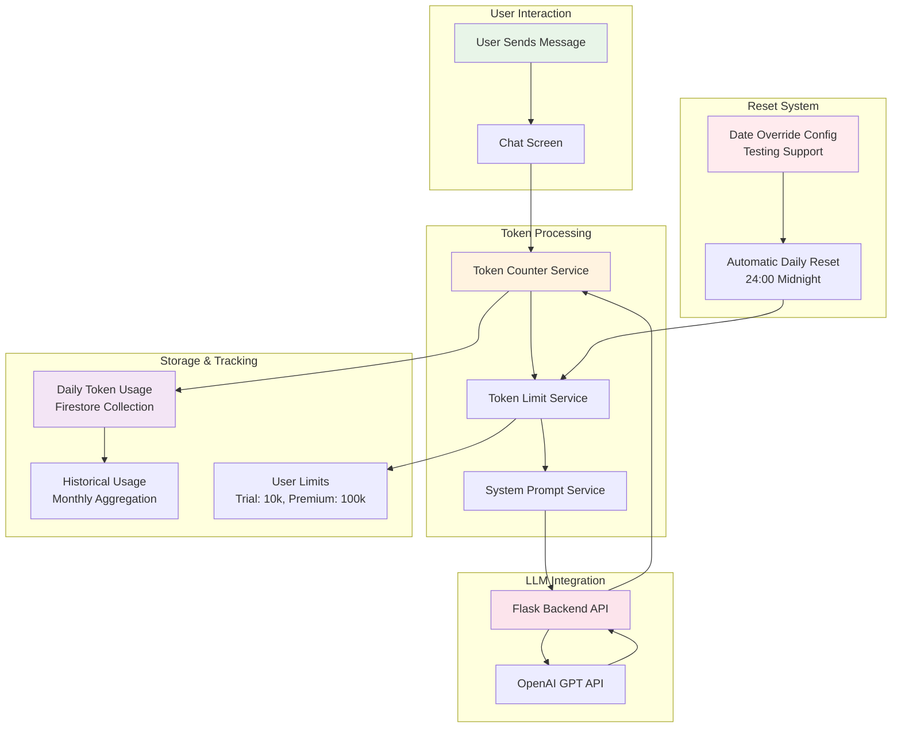
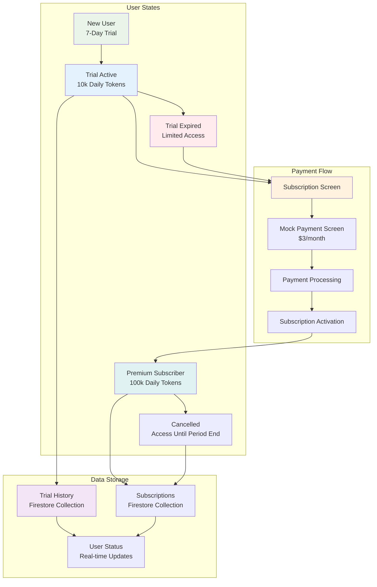
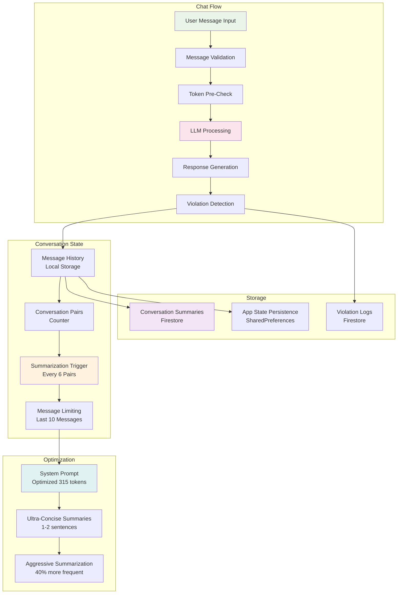
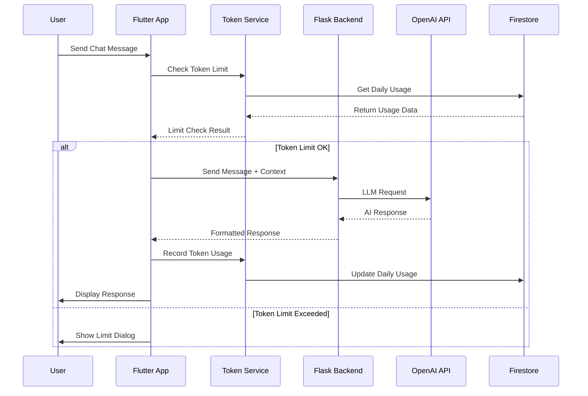

# Kapwa Companion - System Architecture Diagrams

## 1. High-Level System Architecture

## 2. Flutter App Architecture

## 3. Token Management System

## 4. Subscription Management Flow

## 5. Conversation Management System

## 6. Data Flow Architecture

## How to Use in Draw.io:

1. **Open Draw.io** (app.diagrams.net)
2. **Create New Diagram**
3. **Insert → Advanced → Mermaid**
4. **Copy and paste** any of the above Mermaid code blocks
5. **Click "Insert"** to generate the diagram
6. **Edit and customize** as needed

Each diagram focuses on a different aspect of your system:
- **Diagram 1**: Overall system architecture
- **Diagram 2**: Flutter app structure  
- **Diagram 3**: Token management system
- **Diagram 4**: Subscription flow
- **Diagram 5**: Conversation management
- **Diagram 6**: Data flow sequence

You can use these individually or combine them for comprehensive documentation!