# Kapwa Companion - Code Architecture (Mermaid Format)

## Complete Flutter Project Code Architecture

```mermaid
graph TB
    subgraph "🚀 Application Entry Point"
        MAIN[main.dart<br/>App Initialization<br/>Firebase Setup]
        FIREBASE[firebase_options.dart<br/>Platform Configuration]
    end
    
    subgraph "⚙️ Core Layer"
        CONFIG[config.dart<br/>App Configuration<br/>Token Limits<br/>Date Override]
        TOKEN_COUNTER[token_counter.dart<br/>Token Calculation<br/>Input/Output Counting]
    end
    
    subgraph "📱 Screens Layer"
        subgraph "🔐 Authentication"
            AUTH_WRAPPER[auth_wrapper.dart]
            LOGIN[login_screen.dart]
            SIGNUP[signup_screen.dart]
            FORGOT_PWD[forgot_password_screen.dart]
            EMAIL_VERIFY[email_verification_screen.dart]
        end
        
        subgraph "💬 Main Features"
            MAIN_SCREEN[main_screen.dart<br/>Navigation Hub]
            CHAT[chat_screen.dart<br/>AI Conversation]
            PROFILE[profile_screen.dart<br/>User Management]
            CONTACTS[contacts_screen.dart<br/>OFW Directory]
            STORY[story_screen.dart<br/>Content Library]
            PODCAST[podcast_screen.dart<br/>Audio Content]
        end
        
        subgraph "💳 Payment & Subscription"
            SUB_MGMT[subscription_management_screen.dart<br/>Plan Management]
            SUB_SCREEN[subscription_screen.dart<br/>Upgrade Flow]
            PAYMENT[payment_screen.dart]
            MOCK_PAYMENT[mock_payment_screen.dart<br/>Testing Interface]
            PAYMENT_FORM[payment_form_screen.dart]
            PAYMENT_CONFIRM[payment_confirmation_screen.dart]
            BILLING_MGMT[billing_management_screen.dart]
        end
        
        subgraph "👨‍💼 Admin Features"
            ADMIN_DASH[admin_dashboard_screen.dart<br/>System Overview]
            USER_MGMT[user_management_screen.dart<br/>User Administration]
            ADMIN_BILLING[admin_billing_dashboard.dart<br/>Revenue Analytics]
            USER_BILLING[user_billing_details_screen.dart]
        end
        
        subgraph "🎨 Views"
            CHAT_VIEW[chat_screen_view.dart<br/>UI Components]
            PROFILE_VIEW[profile_view.dart<br/>Profile Layout]
        end
    end
    
    subgraph "🔧 Services Layer"
        subgraph "🔑 Authentication Services"
            AUTH_SVC[auth_service.dart<br/>Firebase Auth]
            EMAIL_SVC[email_verification_service.dart<br/>Email Validation]
        end
        
        subgraph "💬 Conversation Services"
            CONV_SVC[conversation_service.dart<br/>Chat Management<br/>Summarization]
            SYSTEM_PROMPT[system_prompt_service.dart<br/>Optimized Prompts]
            SUGGESTION_SVC[suggestion_service.dart<br/>Chat Suggestions]
            ENHANCED_SUG[enhanced_suggestion_service.dart]
            VIOLATION_LOG[violation_logging_service.dart<br/>Content Moderation]
        end
        
        subgraph "🎯 Token Management"
            TOKEN_LIMIT[token_limit_service.dart<br/>Daily Limits<br/>Usage Tracking]
            DAILY_RESET[daily_reset_service.dart<br/>Midnight Reset Logic]
            HISTORICAL[historical_usage_service.dart<br/>Usage Analytics]
            MONTHLY_AGG[monthly_aggregation_service.dart<br/>Data Aggregation]
        end
        
        subgraph "💰 Payment & Billing"
            PAYMENT_SVC[payment_service.dart<br/>Transaction Processing]
            PAYMENT_CONFIG[payment_config_service.dart<br/>Payment Settings]
            BILLING_SVC[billing_service.dart<br/>Billing Logic]
            BILLING_SCHEDULER[billing_scheduler_service.dart<br/>Automated Billing]
            SUB_SVC[subscription_service.dart<br/>Plan Management]
        end
        
        subgraph "🤖 AI Integration"
            OPENAI_SVC[openai_service.dart<br/>GPT Integration]
            LLAMA_SVC[llama_service.dart<br/>Alternative LLM]
        end
        
        subgraph "📊 Data Services"
            FIRESTORE_SVC[firestore_service.dart<br/>Database Operations]
            CONTACT_SVC[contact_service.dart<br/>OFW Directory]
            USER_STATUS[user_status_service.dart<br/>Status Management]
            USAGE_SVC[usage_service.dart<br/>Usage Tracking]
        end
        
        subgraph "🎵 Media Services"
            AUDIO_SVC[audio_service.dart<br/>Audio Playback]
        end
    end
    
    subgraph "📦 Models Layer"
        USER_MODEL[user.dart<br/>User Entity]
        TOKEN_USAGE[daily_token_usage.dart<br/>Usage Tracking]
        TOKEN_INFO[token_usage_info.dart<br/>Usage Information]
        TOKEN_HISTORY[token_usage_history.dart<br/>Historical Data]
        SUBSCRIPTION[subscription.dart<br/>Subscription Entity]
        OFW_CONTACT[ofw_contact.dart<br/>Contact Entity]
    end
    
    subgraph "🎨 Widgets Layer"
        subgraph "💬 Chat Widgets"
            CHAT_BUBBLE[chat_bubble.dart<br/>Message Display]
            TYPING_IND[typing_indicator.dart<br/>Loading Animation]
            SUGGESTION_CHIP[suggestion_chip.dart<br/>Quick Replies]
        end
        
        subgraph "💳 Subscription Widgets"
            SUB_STATUS[subscription_status_widget.dart<br/>Status Display]
            SUB_BANNER[subscription_status_banner.dart<br/>Status Banner]
            SUB_INDICATOR[subscription_status_indicator.dart<br/>Status Icon]
            SUB_MONITOR[subscription_monitor.dart<br/>Real-time Monitor]
            SUB_COMPARISON[subscription_plan_comparison.dart<br/>Plan Comparison]
            SUB_CONFIRM[subscription_confirmation_dialog.dart<br/>Confirmation Dialog]
            PROFILE_SUB[profile_subscription_section.dart<br/>Profile Integration]
        end
        
        subgraph "🎯 Token & Usage Widgets"
            TOKEN_WIDGET[token_usage_widget.dart<br/>Usage Display]
            CHAT_LIMIT[chat_limit_dialog.dart<br/>Limit Notification]
            APP_BAR_STATUS[app_bar_status_indicator.dart<br/>Header Status]
        end
        
        subgraph "💳 Payment Widgets"
            PAYMENT_METHOD[payment_method_management_widget.dart<br/>Payment Methods]
        end
        
        subgraph "🔧 Utility Widgets"
            LOADING[loading_state_widget.dart<br/>Loading States]
            FEEDBACK[feedback_widget.dart<br/>User Feedback]
            EMAIL_BANNER[email_verification_banner.dart<br/>Verification Notice]
            AUDIO_PLAYER[audio_player_widget.dart<br/>Media Player]
            PLACEHOLDER[placeholder_widget.dart<br/>Empty States]
        end
    end
    
    subgraph "🛠️ Utils Layer"
        DATE_HELPER[date_test_helper.dart<br/>Date Testing Utilities]
    end
    
    subgraph "📁 Data Layer"
        APP_ASSETS[app_assets.dart<br/>Static Assets<br/>Configuration Data]
    end
    
    subgraph "🧪 Examples & Tests"
        DATE_EXAMPLE[date_testing_example.dart<br/>Date Override Examples]
        SUB_TEST[subscription_card_test_screen.dart<br/>UI Testing]
    end
    
    %% Main Flow Connections
    MAIN --> CONFIG
    MAIN --> FIREBASE
    MAIN --> AUTH_WRAPPER
    
    %% Core Dependencies
    CONFIG --> TOKEN_COUNTER
    CONFIG --> TOKEN_LIMIT
    CONFIG --> DAILY_RESET
    
    %% Screen Dependencies
    AUTH_WRAPPER --> LOGIN
    AUTH_WRAPPER --> SIGNUP
    MAIN_SCREEN --> CHAT
    MAIN_SCREEN --> PROFILE
    CHAT --> CHAT_VIEW
    PROFILE --> PROFILE_VIEW
    
    %% Service Dependencies
    CHAT --> CONV_SVC
    CHAT --> TOKEN_LIMIT
    CHAT --> SYSTEM_PROMPT
    CONV_SVC --> OPENAI_SVC
    TOKEN_LIMIT --> HISTORICAL
    SUB_MGMT --> SUB_SVC
    SUB_SVC --> PAYMENT_SVC
    
    %% Widget Dependencies
    CHAT_VIEW --> CHAT_BUBBLE
    CHAT_VIEW --> TYPING_IND
    CHAT_VIEW --> SUGGESTION_CHIP
    PROFILE_VIEW --> SUB_STATUS
    PROFILE_VIEW --> TOKEN_WIDGET
    
    %% Model Dependencies
    TOKEN_LIMIT --> TOKEN_USAGE
    SUB_SVC --> SUBSCRIPTION
    AUTH_SVC --> USER_MODEL
    
    %% Data Dependencies
    FIRESTORE_SVC --> USER_MODEL
    FIRESTORE_SVC --> TOKEN_USAGE
    FIRESTORE_SVC --> SUBSCRIPTION
    
    %% Styling
    style MAIN fill:#ff6b6b,color:#fff
    style CONFIG fill:#4ecdc4,color:#fff
    style TOKEN_COUNTER fill:#4ecdc4,color:#fff
    style CHAT fill:#45b7d1,color:#fff
    style CONV_SVC fill:#96ceb4,color:#fff
    style TOKEN_LIMIT fill:#feca57,color:#fff
    style SUB_SVC fill:#ff9ff3,color:#fff
    style OPENAI_SVC fill:#54a0ff,color:#fff
    style FIRESTORE_SVC fill:#5f27cd,color:#fff
    style USER_MODEL fill:#00d2d3,color:#fff
    style TOKEN_USAGE fill:#ff9f43,color:#fff
    style CHAT_BUBBLE fill:#1dd1a1,color:#fff
    style SUB_STATUS fill:#feca57,color:#fff
```

## Detailed Layer Breakdown

### 🏗️ Architecture Layers:

1. **Application Entry Point** - App initialization and Firebase setup
2. **Core Layer** - Configuration and core utilities
3. **Screens Layer** - UI screens organized by feature
4. **Services Layer** - Business logic and external integrations
5. **Models Layer** - Data entities and structures
6. **Widgets Layer** - Reusable UI components
7. **Utils Layer** - Helper utilities and tools
8. **Data Layer** - Static data and assets

### 🔄 Key Dependencies:

- **Config drives everything** - Central configuration for tokens, dates, limits
- **Services handle business logic** - Clean separation of concerns
- **Widgets are reusable** - Modular UI components
- **Models define data structure** - Type-safe data handling

### 🎯 Key Features Highlighted:

- **Token Management System** - Complete flow from UI to database
- **Subscription Management** - End-to-end payment and billing
- **Conversation System** - AI integration with optimization
- **Authentication Flow** - Complete user management
- **Admin Dashboard** - System administration tools

This diagram shows the complete code architecture of your Kapwa Companion Flutter project, including all major components and their relationships!